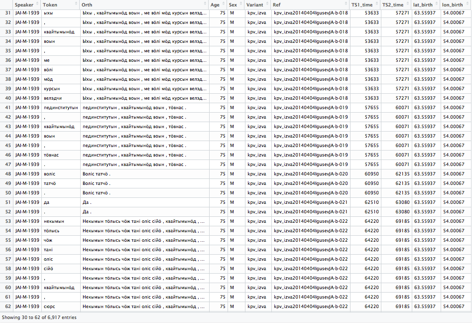

```{r, echo=FALSE}
library(tidyverse)
library(FRelan)
```


### What this is about

Update from May 2017: Lots of things have changed, for example, at the moment I would prefer doing things with `purrr::map` instead of `plyr`, on the other hand this would leave complete rewrite of many functions and the `purrr` approach just is so convenient. Even more, the list columns in dataframes have been gaining popularity lately, and that may be very convenient for language documentation data as well, which doesn't necessarily fit so neatly into a tabular representation.


This treatment may appear little bit chaotic and unstructured, but this is only because the topic in hand is relatively complicated. I try to explain it to different audiences, but I also understand that following the whole text demands knowledge about some documentary linguistic practices and programming language R. The main idea is to present ways to use R to work with ELAN files. The main idea is to get from something like this:


Into something like this:



As one can see, not all data in this data frame comes from ELAN file directly. In my opinion this is one of the major reasons to use R to work with ELAN files. Associating session name or speaker id with any arbitrary pieces of information suddenly become trivially easy. In this case I have just merged some metadata with the tokens, but naturally there is no end to what one can have there. I have sorted the data here by speaker and the time, whereas sorting it only with time would of course bring to the table the natural order in which the utterances were spoken. In principle one could use more complicated data structures to store the ELAN file's content, but in my opinion a data frame is just fine since it is very easy to work with. I will go through now only how one reads ELAN files -- metadata comes later. I can just say briefly that what I'm usually doing is to open database connection from R to FileMaker Pro and to read the metadata from there. Now perfect, but works fine and is easy.

I wrote already some year ago a small R package that can be used to parse ELAN files. We've called it `FRelan`, as it is developed with Freiburg based language documentation traditions. There is just one small problem -- it works out of the box only with our ELAN files. The reason is that ELAN files can be structured in almost any possible way. As far as I see it, it is almost impossible to write a package which would just work automatically. However, I think it is possible to write some kind of generic tools which can be adapted into most of the files, and following the same logic one can also parse more exotic tier structures if the need arises.

FRelan package can be installed from GitHub with `devtools` package:

    install.packages("devtools")
    devtools::install_github("langdoc/FRelan")

However, one should probably read this post thoroughly before attempting to use it. (And do not try to do that before this post is 'officially' published, because it is guaranteed to be work very weirdly!)

In an ideal world one could read ELAN file into R just typing:

    FRelan::read_eaf(file = "elan_file.eaf")
    
And this is how it works with our ELAN files, but I want to help others to achieve the same with their corpora!  Of course usually the idea would be to read in the whole corpus, which can be achieved easiest this way:

    eaf_files <- list.files(path = "path/to/corpus/main/folder", 
                            pattern = "eaf$", 
                            full.names = T, 
                            recursive = T, )
    corpus <- plyr::ldply(eaf_files, FRelan::read_eaf) # could be nicer with purrr::map

What happens here is also relatively simple. I use `list.files` function to find all ELAN files recursively. Those files are stored in a character vector which has one element for each ELAN file. After that I use `ldply` function from `plyr` package, which basically loops the function `read_eaf` across each path stored in `eaf_files` and coerces the result into a dataframe. In this point the data frame `corpus` one row for each token in the ELAN files with all information that is present in those files. However, reality is often less beautiful, and the parsing tends to be interrupted in one point or another. If each ELAN file would be perfectly similar in their structure, the loop would work. The majority of problems arise from tiny hidden inconsistencies which at least my files tend to be ridden with. I would call these an **invisible problem**, because they never really pop up in our daily work with ELAN corpus, but actually cause very large number of issues behind the scenes. So in the end very much about **parsing ELAN files into R** is actually about **finding out which ELAN files are inconsistent with R**.

Lots of common tasks use packages `plyr`, `dplyr`, `xml2` and `XML`, so installing those is necessary. Especially two first mentioned are very useful in general. Update from 2017: Now it is possible to install most of these with `install.packages('tidyverse')`. It is good to note that `plyr` is not part of [tidyverse](http://tidyverse.org/), although few years ago it was the most convenient tool for plenty of tasks.

    library(tidyverse)
    librar(FRelan)

In this tutorial I use ELAN file called `kpv_izva20140404IgusevJA.eaf`, which is a long interview I made with Komi researcher Jevgeni Aleksandrovich Igushev in 2014. 

    test_file <- "kpv_izva20140404IgusevJA.eaf"

```{r read_test_file, echo=FALSE}
test_file <- "~/langdoc/kpv/kpv_izva20140404IgusevJA/kpv_izva20140404IgusevJA.eaf"
```


### Introduction

This writing is part of the wider topic of how to get documentary linguistic data into R. This means not only reading in ELAN files, but doing the same for metadata and other accompanying datasets we may have with our corpus. There are many reasons one may want to have documentary linguistic corpus in R. It makes searching the data very easy, and one is not limited to the predefined possibilities of individual user-interface. Besides this it is easy to make the study entirely reproducible, as there is no unnecessary mouse clicking involved. One can do at least the following tasks entirely in R:

- Searching the ELAN corpus
- Detecting structural mistakes or typos in ELAN corpus
- Opening ELAN files directly from R
- Associating linguistic data with metadata
- Plotting the search results or corpus content in different ways
- Doing the statistical evaluations of your results

R has already for many years been used in variationistic sociolinguistics, and also in that world use of ELAN has been around [@nagyEtAl2015a]. In their present paper Nagy and Meyerhoff suggest a possible workflow. However, this workflow is also based upon exporting the ELAN files into CSV format, which is then being read into R. Reading these files into R is trivially easy, but it creates uneasy situation where doing changes in the data demands creation of a new export file. The situation gets even more problematic if there are further annotations done to those spreadsheets, as it can get quite messy to append the changes from modified ELAN files into annotated tables. This is very typical problem, in my opinion, and there are very few satisfactory solutions to the general problem (which also persists in ELAN when the transcriptions are modified but there are annotations already on the tiers below).

All treatments of data analysis with R start with the notion that one has to get the data into R (see, for example [@wickhamEtAl2016a]). Getting data into R is basically a data transformation, and the method of doing the import is to define this transformation and run it whenever needed. So the question can also be turned into a statement: if data can be transformed, then it can be read into R. By transformation I mean any kind of operation where the data is parsed, in its totality or with some subset, and turned into whatever other data structure we need without information being lost. Or if the information is lost, it should be clearly understood and acknowledged.

In order to be able to make this kind of transformations to the corpus, the data structures have to be perfectly described and systematically present in the files. Actually making sure that this is the case would be very easy, for example, with [parameterized RMarkdown reports](http://rmarkdown.rstudio.com/developer_parameterized_reports.html). The R functions to parse ELAN files are kind of backbones of this kind of testing, about which I should probably be writing more soon.

I think often when there is talk about data formats there is some confusion over the fact that the data should be in different structures in different parts of its life. Of course these stages are not really distinct from one another, but there are clear conceptual differences and requirements which I try to outline below. 

- data editing: minimal repetition of fields
- data archiving: maximal usability for different purposes
- data analysis: wide applicability for different statistics and plotting

All these stages have different demands for the ideal data structures, and we should not imagine that there is just one solution for this. Naturally this is a two way street, so that during data analysis one often needs to edit the data and come back to analysis. If we think about the resulting dataset in terms of **tidy data**, where we would ideally have one row per one observation [@wickham2014a], then I think we often should consider **token** as the basic unit here. The resulting data is relatively ineffective in the sense that the same information is repeated all over the place, but it is **tidy** according to some specifications. It can be described also as **long**, as there are relatively few columns and the data is stored along the rows. This kind of data structure is not supposed to be edited by human, but computers crunch it very happily.

### Technical part

There are many ways to parse ELAN file into R, and ultimately it boils down to the question **what do you want to do**? Usually I want to search from the data in R or I want to merge some content with metadata, either to make more complex searches or to check what is going on. However, the scope varies. If I think in terms of ELAN's tier structure, there are following attributes we can use:

- linguistic type (ideally each file would have one tier of one type per speaker)
- speaker
- tier name (although this is complicated -- what is tier name but combination of attributes above?)

Reading ELAN files into R is not trivially easy and it gets fast very complicated. The main question is always how uniform the ELAN files are in their basic structure. This is really where all problems begin. If all ELAN files are identical, then one can just specify the pattern to parse one and loop it over all files. However, in reality the situation is much more complicated, and ELAN files tend to be somewhat heterogenic. There is nothing in ELAN that would prevent small creeping in here and there, and what may look harmless for a human, for example, slightly different name of a linguistic type, is of course impassable barrier for a computer which tries to read the file. So the code to parse ELAN files often needs to have all kinds of bells and whistles attached into it to handle errors, which makes the code very complicated and there is always possibility that something fails in a new way.

However, this is what makes parsing ELAN files to R particularly rewarding as well. It tells where the problems are, and makes it easier to address them. It can thereby be tested also as a robust testing method which helps to keep ELAN files organized. As far as I see it, the fact that all files adhere to uniform structure should be among the most basic definitions we have for **corpus**, differentiating it from eclectic file collections. This comes back to what I was describing above: if corpus is parsable, it is also transformable, and this is actually guarantees its longevity. It is not likely that in thirty years we want data to be in exactly this kind of XML files, but if they are perfectly uniform doing the transformation will never be more than a fast and easy task, whereas currently that can be quite a nightmare.

#### Reading one tier

I go first through how to set up a function to read one tier, since in principle the rest is combining this in different ways. In principle one could take this function and combine it in smart ways to read the complete file.

```{r read_tiers, eval=T}

FRelan::read_tier(eaf_file = test_file, linguistic_type = "wordT") %>% 
        dplyr::slice(1:15) %>% # This slices 15 rows
        knitr::kable() # This displays table nicely

FRelan::read_tier(eaf_file = test_file, linguistic_type = "refT") %>% 
        dplyr::slice(1:5) %>%
        knitr::kable()

# kable() thinks the id's are email addresses, have to look into that in some point...

```

The trick here is that the result is a data frame which contains all crucial information from the individual tiers. And as we are familiar with the tier hierarchy we can combine the results of different `read_tier()` functions to eventually get the whole file. Only difficulty will be with getting the actual time slots, but on the other hand that is also trivially easy, since that is expressed the same way in each and every ELAN file. In `FRelan` package there is a function `read_timeslots()` which can be used to match those values.

#### Reading whole ELAN file

Reading the whole ELAN file is essentially about figuring out the pattern how the tiers connect by their id's and imitate this pattern when joining different data frames. Of course there are many other things we want to do, for example, it makes sense to process and tidy the output already while it is being parsed. There are things such as right and left context, removing empty values, making some first calculations about the occurrences etc. This can be done automatically, but starting to set this up very easily leads into a situation where the model is clearly project specific, and not easily extended to be used by others. However, the model I propose here for joining the files tier by tier should be pretty bullet proof.

Structure of the ELAN file we are using with Komi is basically like this:

    |-ref (id)
    \- orth (kpv)
      \- word (tokenized from orth)
    \- ft-rus (Russian translation)
    \- ft-eng (English translation)
    \- note (different notes on utterance level)

So what we have in the utterance level table above is the content of the tiers with `wordT` linguistic type. The time slots are empty, because the tier is not independent. When I have parsed the tier with the type `refT` the id's are there. There are some situations where one wants to have the id's around, but I think in many situations it is equally possible to leave them out once they have been used to do the joins.

I usually find it easiest to start from the smallest possible unit, which in this case would be a token. In the end I want one token to be one row.

The `annot_id` of transcription tier is the `ref_id` of the token level tier.

```{r read_whole_file}

elan_file <- FRelan::read_tier(eaf_file = test_file, linguistic_type = "wordT") %>%
        dplyr::select(content, ref_id, participant) %>%
        dplyr::rename(token = content) %>%
        dplyr::rename(annot_id = ref_id) %>%
        dplyr::left_join(FRelan::read_tier(eaf_file = test_file, linguistic_type = "orthT")) %>%
        dplyr::select(token, content, participant, ref_id) %>%
        dplyr::rename(utterance = content) %>%
        dplyr::rename(annot_id = ref_id) %>%
        dplyr::left_join(FRelan::read_tier(eaf_file = test_file, linguistic_type = "refT")) %>%
        dplyr::select(token, utterance, content, participant, time_slot_1, time_slot_2) %>%
        dplyr::rename(reference = content)

elan_file %>% dplyr::slice(1:15) %>% knitr::kable()

# Note: add also some translation tiers to this

```

After this it is already very simple to grab the time slot values and associate them with this data frame. And in this point we can even throw away the time slot id's, as those really do not give us very much information about anything outside ELAN XML file. This join is little bit strange because the same information has to be joined twice -- each row has start and end time associated with it.

```{r get_timecodes}

elan_file %>% dplyr::left_join(FRelan::read_timeslots(eaf_file = test_file), 
                               by = c("time_slot_1" = "time_slot_id")) %>%
        dplyr::rename(time_start = time_value) %>%
        dplyr::left_join(FRelan::read_timeslots(eaf_file = test_file), 
                         by = c("time_slot_2" = "time_slot_id")) %>%
        dplyr::rename(time_end = time_value) %>%
        dplyr::select(-time_slot_1, -time_slot_2) -> elan_content

elan_content %>% dplyr::slice(1:15) %>% knitr::kable()

```

And that's about it! Now one can ask what is this worth? What can one do with ELAN files in R? I will return to this later, but now I give just a trivial example. First of all, we can instantly know what there is in the corpus. For example, this tells how the tokens are distributed by the speakers:

```{r}
elan_content %>% count(participant) %>% knitr::kable()
```

Or let's say we have some arbitrary metadata. Sex, age -- which in this case already hide in the naming convention -- education level, birthplace, language acquisition history, any variables like these can be easily merged with the data from the ELAN files. And the best part is that the feedback is instant. If we modify ELAN files we can always just parse them again and evaluate the results with the changed files.

I hope this excersice has been useful for someone. If there are questions please don't hesitate to contact me by email (nikotapiopartanen@gmail.com). I've been working with R and ELAN for several years now, but in many ways I'm also just discovering new possibilities every day. The treatment I've presented here is quite satisfactory in the sense that I believe it is elegant enough that one should avoid many parsing errors with heterogenous ELAN corpora. However, I think that detecting and fixing errors in ELAN files is certainly a topic worth its own longer posting. I have added below couple of functions which can be combined in different ways to find out some properties of ELAN files. I think usually the problems in ELAN files are connected to missing or wrongly named tiers or types.

There are also lots of ways to search from the result:

```{r}
elan_content %>% FRelan::find_token(".+иг.+")
# About the same as:
# elan_content %>% filter(str_detect(token, '.+иг'))
```

<!--

```{r note_core, eval=F, echo=FALSE}
        #        file %>% xml2::xml_find_all(paste0("//TIER[@LINGUISTIC_TYPE_REF='", linguistic_type, "']")) %>%
        #                xml2::xml_attr("PARTICIPANT") -> participant
```

### Helper function

#### Testing if tier exists

I'm always ranting about the lack of uniformity in corpora, so let's come up first with some tools we can use to make the actual parsing of ELAN files more reliable. First of all we need something to check whether a tier exists. This is already very useful, for example, while looping across the files and trying to sniff the files which are missing some crucial tiers. Or maybe we want to get rid of some tiers! Whatever the goal, this helps to hunt them down.

```{r}
FRelan::tier_exists

tier_exists(eaf_file = test_file, 
            tier = "word@JAI-M-1939")
tier_exists(eaf_file = test_file, 
            tier = "token@JAI-M-1939")

```

#### Testing if tier is empty

This little function does two things -- and can be used uncountable ways! If the value is specified as `TRUE`, it gives the number of items on that tier. This is often useful to know! However, it can also just tell us whether the tier is empty or not. For example, one could easily loop this across the files to find out all ELAN files where the tier that is supposed to contain the tokenized words has not been populated by the tokens.

```{r}

FRelan::tier_has_content

# This tier has content
tier_has_content(eaf_file = test_file, 
                 tier = "word@JAI-M-1939", 
                 value = F)
# This tier exists, but has no content
tier_has_content(eaf_file = test_file, 
                 tier = "phonet-UPA@JAI-M-1939", 
                 value = F)
# This tier is full of content, actually
tier_has_content(eaf_file = test_file, 
                 tier = "word@JAI-M-1939", 
                 value = T)
# This tier doesn't exist
tier_has_content(eaf_file = test_file, 
                 tier = "token@JAI-M-1939", 
                 value = T)

```

-->

### References
