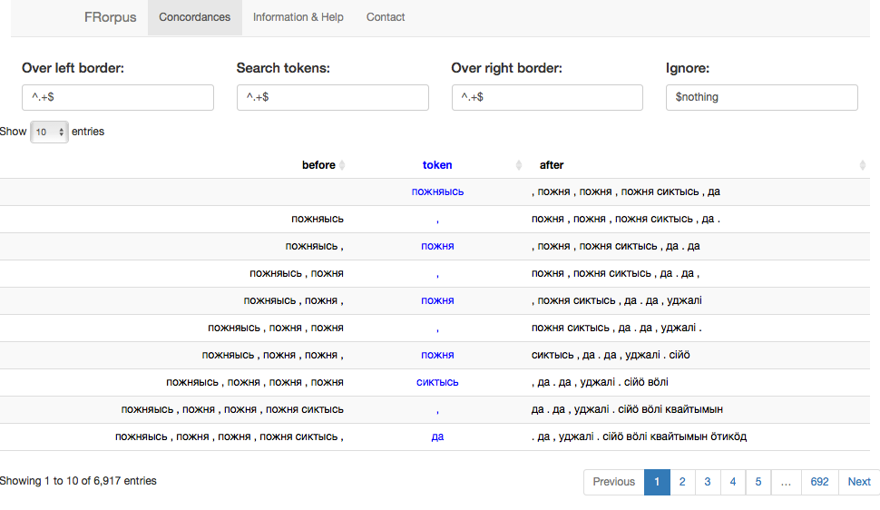

In the earlier blog post I went through quite extensible and easy way to parse ELAN files into R. Of course the question **what is this good for?** has not yet been properly answered. I understand some people are reluctant to use R as it doesn't really have any user interface. Late developments with Shiny web application framework is good answer to this, since it offers only not an user interface, it is also dead simple to set up.

On Shiny website it is advertised with idea that no HTML or JavaScript are required. Well, this is a half-truth in my opinion. To do some really fancy things one certainly needs to know more than just R -- but actually knowing only that is already a good start. Maybe one problem is that as linguists we may come up with all kind of wishes which aren't exactly in the mainstream in wider framework where these things are developed.

But let's not talk about the problems but about what we can do.

The earlier post ended into parsing of one ELAN file. Let's continue with that.

```{r, echo=F, message=F, warning=F}
library(plyr)
library(dplyr)
library(FRelan)

test_file <- "/Volumes/langdoc/langs/kpv/kpv_izva20140404IgusevJA/kpv_izva20140404IgusevJA-ipa.eaf"

eaf <- FRelan::read_tier(eaf_file = test_file, linguistic_type = "wordT") %>%
        dplyr::select(content, ref_id, participant) %>%
        dplyr::rename(token = content) %>%
        dplyr::rename(annot_id = ref_id) %>%
        dplyr::left_join(FRelan::read_tier(eaf_file = test_file, linguistic_type = "orthT")) %>%
        dplyr::select(token, content, participant, ref_id) %>%
        dplyr::rename(utterance = content) %>%
        dplyr::rename(annot_id = ref_id) %>%
        dplyr::left_join(FRelan::read_tier(eaf_file = test_file, linguistic_type = "refT")) %>%
        dplyr::select(token, utterance, content, participant, time_slot_1, time_slot_2) %>%
        dplyr::rename(reference = content) %>% dplyr::left_join(FRelan::read_timeslots(eaf_file = test_file), 
                               by = c("time_slot_1" = "time_slot_id")) %>%
        dplyr::rename(time_start = time_value) %>%
        dplyr::left_join(FRelan::read_timeslots(eaf_file = test_file), 
                         by = c("time_slot_2" = "time_slot_id")) %>%
        dplyr::rename(time_end = time_value) %>%
        dplyr::select(-time_slot_1, -time_slot_2) -> eaf

eaf$session_name <- "kpv_izva20140404IgusevJA-b"
```

### Keyword in context

In `FRelan` package there is a function `add_kwic()` which adds columns needed for classic Key Word in Context -type of view.

```{r}
eaf <- eaf %>% FRelan::add_kwic()
eaf %>% dplyr::select(before, token, after, session_name, participant) %>% slice(1:10) %>% knitr::kable(align = c("r", "c", "l"))
```

This already starts to remind an environment where one can make searches. For this there are two very simple functions, `find_token()` and `exc_token()`. They take regular expressions, and the idea is that one can just pipe them as needed. They are basically just shorthands for `filter(grepl("regex", token)` but with less typing.

### Searches with Shiny

Shiny framework allows very easy creation of web applications.

```{r, eval=F}
eaf %>% FRorpus()
```

This opens an application like this:



The searches can be refined more either before or after starting the application:


### FRorpus code

```{r}
FRelan::FRorpus
```


